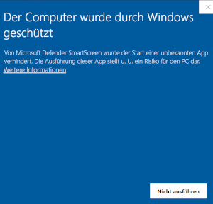
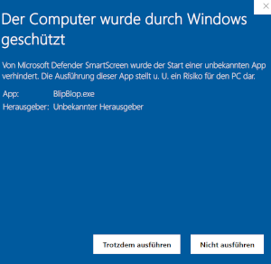

# BlibBlop

A PyQt5 based cross-platform tool to run tiny experiments for measuring reaction times in human observers to visual or auditory stimuli.

## Dependencies

- PyQt5


## Running/Installation 

To run BlipBlop download one of the binaries that matches your platform. (BlipBlop_win.exe for Windows, BlipBlop_linux for Linux and BlipBlop_mac.app for macOS). These zip files need to be extracted. Right-click the zip file and select *extract*.

### Linux (Ubuntu)

To run the application under Linux (tested on Ubuntu 20.04) you need make it executable. Let's assume the downloaded zip file has been extracted in the downloads folder. Open a terminal and execute the following commands:

``` shell
> cd Downloads/BlipBlop-linux/
> chmod a+x BlipBlop
> ./BlipBlop
```

### macOS

The package has been build under macOS 11 (BigSur) and was tested on an Intel and M1 architecture. To run it unzip the downloaded archive and double click the application. 

It may happen that the application will be blocked and a small window informs you about it. Close this window and open *Setttings>Security>General* On the bottom there will be a note saying that the application was blocked and offers you the opportunity to still run it (on your own risk).


### Windows10

Usually you can simply run the app by double-clicking the execuatable. Upon first execution you Windows may block the application stating "The computer has been protected by Windows.":



Click on the "More Information" link which provides additional information and allows you to run the application




## Running from source

To run BlipBlop from source you need to have a python3 evironment and install pyqt5.

``` bash
> pip3 install pyqt5
``` 

Clone the repository

``` shell
> git clone https://github.com/jgrewe/blipblop.git 
```

To run it change into the directory and execute it with python3 

``` shell
> cd blipblop
> python3 blipblop_main.py
```
