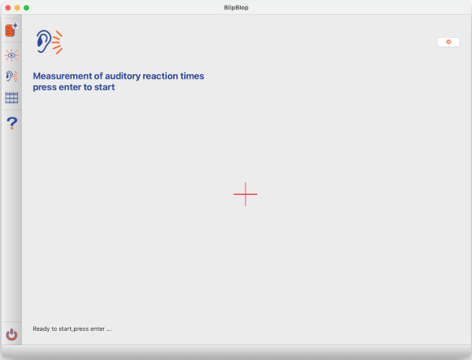
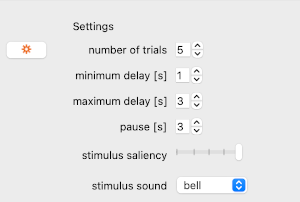

# Auditory reaction times

Once you press *enter* or *return* an experiment starts and automatically proceeds until all trials are done.

1. An experiment consists of a number of *trials*.
2. Before ach trial starts there will be a *pause* which is shown by a countdown appearing at the bottom of the screen.
3. In each trial the stimulus will appear at a random time after trial start.
4. Press the *spacebar* once you recognize the stimulus.
5. Press *esc* to abort the experiment (all data recorded in this experiment are discarded).

## Settings

Pressing the cogwheel in the top right corner allows you to change the settings of the experiment. You can do the changes you want and then close the settings screen by pushing the cogwheel button again.

By default, when you open the tool the first time, 5 trials recorded, and the stimulus will appear at a random time in the interval between *minimum delay* and *maximum delay* after start of a trial. Before the first and between trials a countdown appears. The *pause* can be adjusted and, as the other settings is given in seconds.
The *stimulus saliency* slider controls the loudness of the sound. Of course this setting is not absolute and interferes with the general volume of your loudspeakers. Finally, there are three different sounds which can be selected using the dropdown selection.

All changes will be stored and are persisted even after the program is closed.

[back](index.md)
