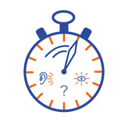
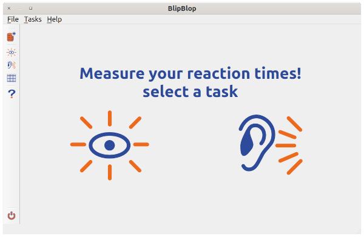

# BlipBlop

BlipBlop is a tiny tool for measuring reaction times upon auditory or visual stimulation. This tool is open-source. The source code can be found on [GitHub](https://github.com/jgrewe/blipblop). It is published under the MIT open source [license](license.md).
Auditory stimuli have been taken from the [freedesktop](https://freedesktop.org) system sounds.

## Main Window

By pressing one of the big icons in the center of the screen you can start an experiment of measuring the [visual](visual_taks.md) or [auditory](auditory_task.md) reaction times. These functions are also available via the **Tasks** menu on top or the buttons in the tool bar (left). Once an experiment has been successfully performed the results can be viewed using the [results screen](results.md) (table icon on the left, or entry in the **Tasks** menu).
You can make several experiments and all results will be stored unless you start a new session (top button in the tool bar or *new session* entry in the **Tasks** menu) or end the program.

The basic handling is very simple:

1. Select a task.
2. Press *enter* or *return* when ready.
3. Fixate the cross in the center of the screen.
4. After a countdown and a stimulus will be shown, or played.
5. Press the *spacebar* as soon as you recognize the stimulus.
6. By default 5 trials are recorded and the program returns to the main screen once the trials are done. You can press the *esc* key to abort an experiment. All data recorded in that task are discarded.

Follow the links in the text above for more information on the individual screens.

## Hints & Ideas

* Record enough data. You will notice that the reaction times may vary a lot. In order to do proper analyses record enough data.
* Play with the stimulus saliency (size or opacity of the visual stimulus or volume, sound of the auditory stimulus).
* Auditory stimuli: compare the performance when closing the eyes or keeping them open.
* Visual stimuli: do not fixate on the central cross but maybe a spot outside the screen that has the disk appear in the visual periphery.
