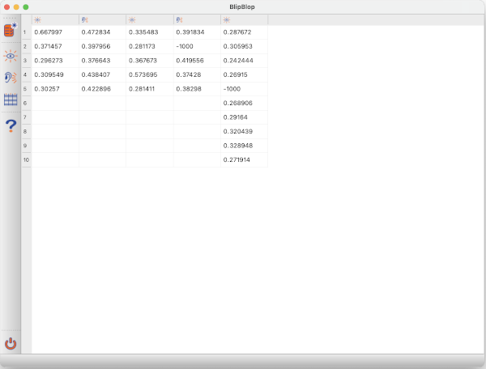

# Results view

A simple tablular view that shows the measured reaction times. Each column is one experiment. Hovering with the mouse over the table header shows a little more information about the task. The icon depicts whether it was a visual or auditory task.

The data is given in seconds. **Invalid** trials (spacebar was pressed before the stimulus actually appeared) are noted with a reaction time of **-1000**

Select the data with the mouse and press (**ctrl+c** or **cmd+c**) to copy the selection to clipboard and paste it into your favorite spreadsheet tool for further analysis.

[back](index.md)
